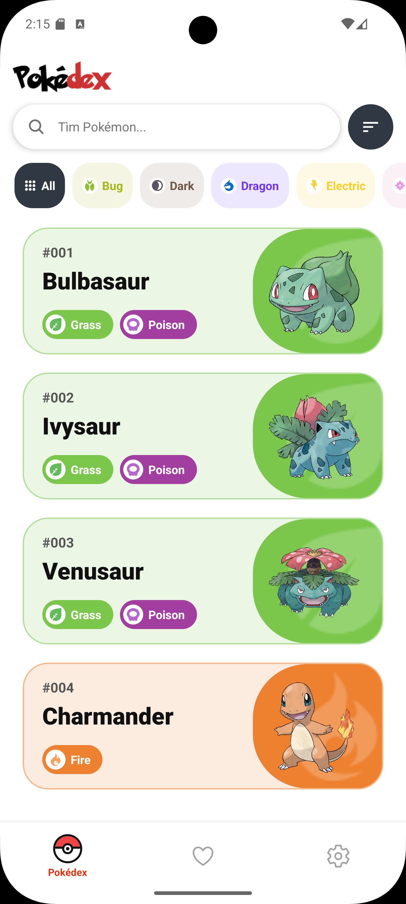
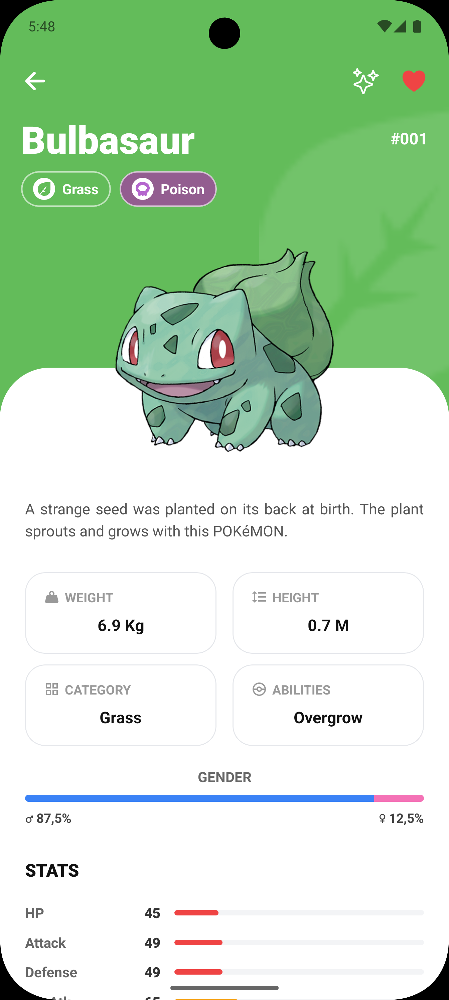
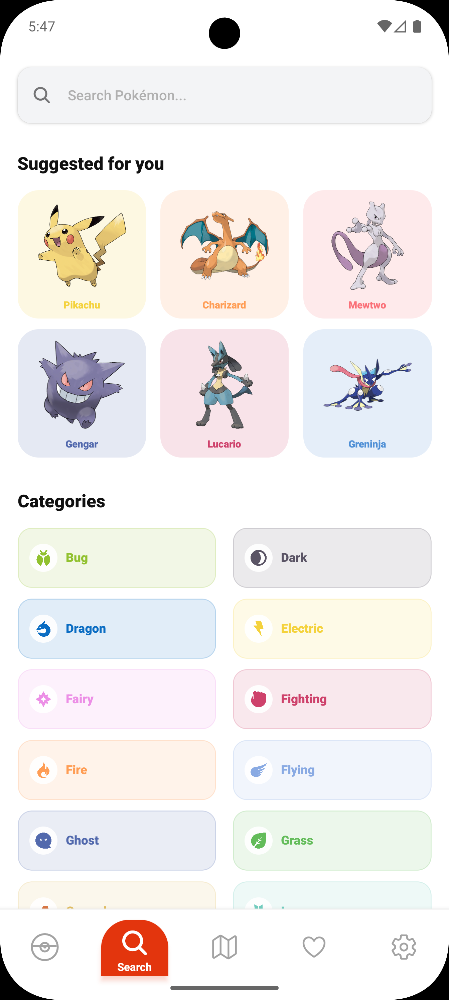
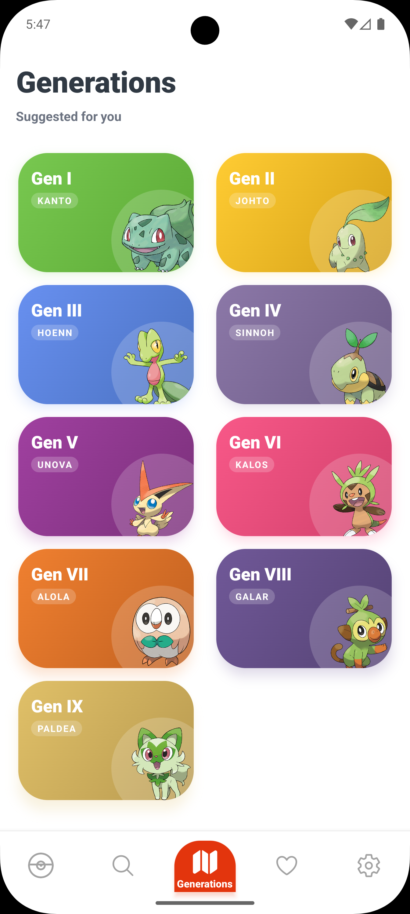
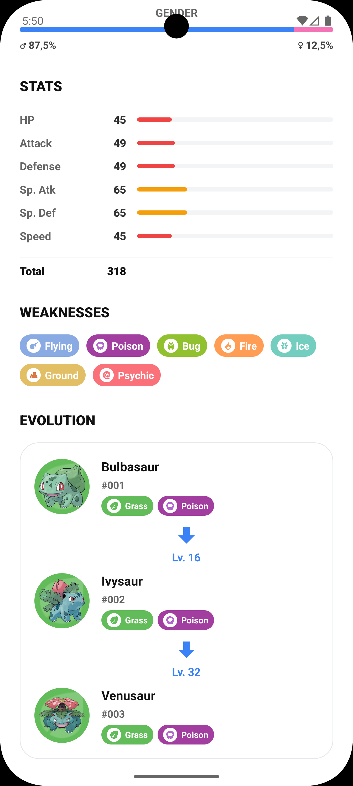
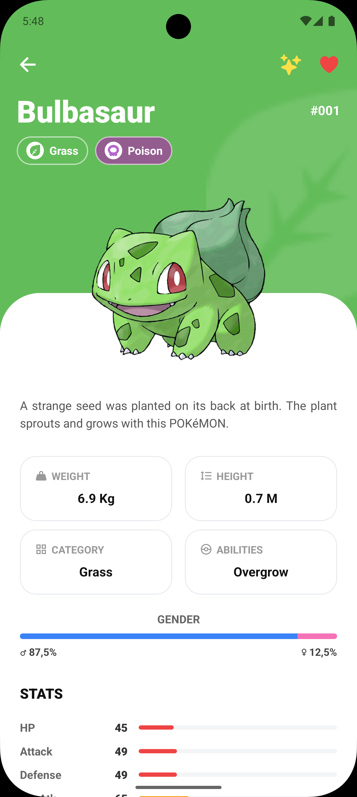
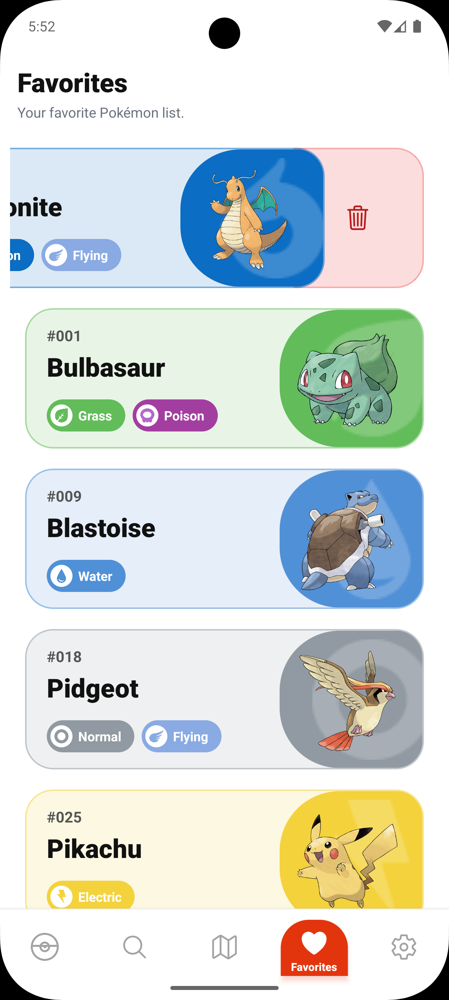

# 📱 Pokédex Mobile

A premium Pokémon encyclopedia built with **React Native** & **Expo**. Experience a stunning UI, smooth animations, and comprehensive data tailored for fans.

---

## 📸 App Showcase

### 🏠 Home & Discovery

<p align="center">
  
  
  
</p>

- **Home**: Clean grid with lazy-loading & pagination.
- **Filter**: Quickly sort by regions and generations.
- **Search**: Instant lookup with optimized debouncing.

### 🧬 Pokémon Details

<p align="center">
  
  
  
</p>

- **Insights**: Biology, abilities, and type weaknesses.
- **Stats**: Visual progress bars & base stats.
- **Evolution**: Complete chains with high-quality sprites.

### ❤️ Personalization

<p align="center">
  
</p>

- **Favorites**: Curate your collection with swipe-to-delete.
- **Settings**: Dark Mode, 6+ Languages, and Metric/Imperial units.

---

## ✨ Key Features

- **⚡ Performance**: Smooth UI with **Tailwind CSS (NativeWind)** & **Reanimated**.
- **🌍 Localization**: English, Tiếng Việt, 日本語, 中文, Español, Français.
- **🌓 Adaptive UI**: Full support for system Light/Dark themes.
- **⚖️ Units**: Switch between **Metric** and **Imperial** systems.
- **💾 Persistence**: Data saved locally using **AsyncStorage**.

---

## 🛠️ Tech Stack

- React Native + Expo 55 + TypeScript
- NativeWind + Reanimated + Zustand
- React Navigation 7 + Axios + PokéAPI

---

## 🚀 Quick Start

```bash
git clone https://github.com/DuyPhatpeo/pokedex.git
cd pokedex
npm install
npx expo start
```

---

*Developed with ❤️ by **Duy Phat***
