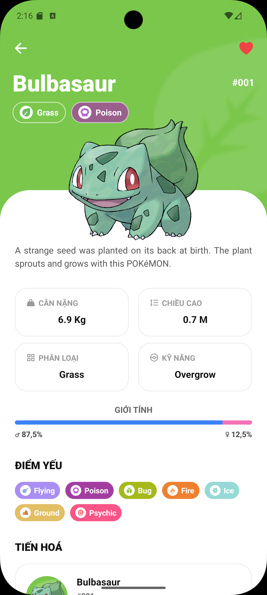

# 📱 Pokedex Mobile App

A beautiful, fully-featured React Native Pokedex application built with Expo and beautifully styled with Tailwind CSS (NativeWind). Discover, learn, and curate your favorite Pokémon in a smooth, responsive, and highly interactive interface!

## 📸 Preview

<p align="center">
  
  
</p>

## ✨ Features

- **Pokédex Explorer**: Browse through an extensive, paginated list of Pokémon.
- **Detailed Insights**: View complete evolution chains, base stats, and type advantages with customized visual badges.
- **Favorites Management**: Save Pokémon to your favorites list. Everything is persisted locally using `AsyncStorage` so your favorites are never lost!
- **Interactive Gestures**: Intuitive "Swipe-to-Delete" functionality in the Favorites screen using `react-native-gesture-handler`.
- **Fluid Animations**: Custom-animated bottom navigation tabs (scaling and transitions) and seamless screen transitions.
- **Optimized UX**: Beautiful loading skeletons (`SkeletonCard`) provide a premium feel while data is fetching from the API.
- **Dark/Light Mode Ready**: Dynamic UI aesthetics adapting perfectly to user preferences.
- **Internationalization (i18n)**: Built-in support for multiple languages.

## 🛠️ Tech Stack

- **Framework**: [React Native](https://reactnative.dev/) powered by [Expo](https://expo.dev/)
- **Styling**: [NativeWind](https://www.nativewind.dev/) (Tailwind CSS for React Native)
- **State Management**: [Zustand](https://zustand-demo.pmnd.rs/) for lightning-fast and easy state control
- **Navigation**: [React Navigation v7](https://reactnavigation.org/) (Native Stack & Bottom Tabs)
- **Data Fetching**: [Axios](https://axios-http.com/) (Integrating with [PokéAPI](https://pokeapi.co/))
- **Local Storage**: `@react-native-async-storage/async-storage`

## 🚀 Getting Started

### Prerequisites

Ensure you have the following installed on your machine:

- [Node.js](https://nodejs.org/) (LTS recommended)
- npm or yarn
- Expo CLI

### Installation

1. **Clone the repository** (or navigate to the project directory):

   ```bash
   cd pokedex
   ```

2. **Install core dependencies**:

   ```bash
   npm install
   ```

3. **Start the Expo Development Server**:

   ```bash
   npm start
   # or
   npx expo start
   ```

4. **Run on your device**:
   - Press `a` to open in **Android Emulator**
   - Press `i` to open in **iOS Simulator** (macOS only)
   - Scan the QR code using the **Expo Go** app on your physical iOS/Android device

## 📂 Project Structure

```text
pokedex/
├── src/
│   ├── api/          # API services (Axios requests, PokéAPI integration)
│   ├── components/   # Reusable UI components (PokemonCard, Skeletons, etc.)
│   ├── i18n/         # Internationalization and language translation files
│   ├── navigation/   # Stack and Tab Navigators configurations
│   ├── screens/      # Main application screens (Home, Detail, Favorites, etc.)
│   ├── store/        # Zustand global state (Favorites store management)
│   ├── types/        # TypeScript interfaces and global type definitions
│   └── utils/        # Helper functions, formatters, and utilities
├── App.tsx           # Entry point wrapper of the app
├── tailwind.config.js# Tailwind CSS / NativeWind configuration
└── package.json      # Dependencies and scripts
```

## 🤝 Contributing

Contributions, issues, and feature requests are always welcome! Let's build the best open-source Pokedex together.
